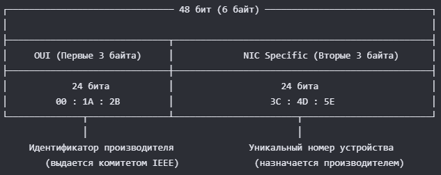
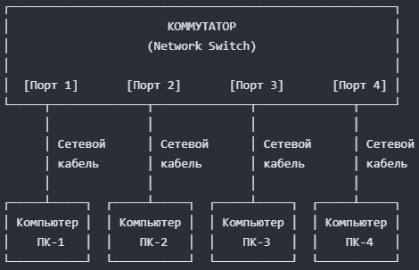

# IPv4 и адресация

1. Структура MAC-адреса: 

2. Схема соединения компьютеров с коммутатором: 

3. Критическая ситуация: Сетевая петля (Switching Loop) и Бродкаст-шторм
Одна из самых частых и опасных ошибок в такой схеме — возникновение коммутационной петли.
Как возникает ситуация:
Она происходит, когда два порта одного коммутатора случайно соединяют между собой одним кабелем, либо создают избыточные связи между двумя коммутаторами без специальной настройки.
Если ПК-1 отправляет широковещательный запрос (например, ARP-запрос «у кого IP-адрес 192.168.1.1?»), коммутатор обязан разослать этот фрейм во все порты. Фрейм попадает в петлю, начинает бесконечно циркулировать по кругу и размножаться. Это вызывает широковещательный шторм (Broadcast Storm).
Следствие ошибки: Процессор коммутатора загружается на 100%, индикаторы портов начинают бешено и одновременно мигать, сеть полностью «ложится», а компьютеры теряют связь друг с другом и с интернетом.

Как это можно исправить:
1) Экстренное (физическое) решение:
* Локализовать и физически отключить лишний кабель, замыкающий порты коммутатора. Если коммутаторов много, поочередно отключайте соединяющие их кабели (аплинки), пока сеть не восстановит работу.
2) Системное (программное) решение:
* Использовать управляемые коммутаторы с поддержкой протокола STP (Spanning Tree Protocol) или его современных версий (RSTP, MSTP).
* Принцип работы STP: Протокол автоматически определяет наличие избыточных линий (петель) в сети и программно блокирует «лишний» порт. Если основная линия связи оборвется, STP автоматически разблокирует резервный порт, сохранив работоспособность сети без штормов.
* На уровнях доступа (где подключаются ПК) рекомендуется включать функции Loopback Detection или Storm Control, которые автоматически отключают конкретный порт при обнаружении зацикленного трафика.
