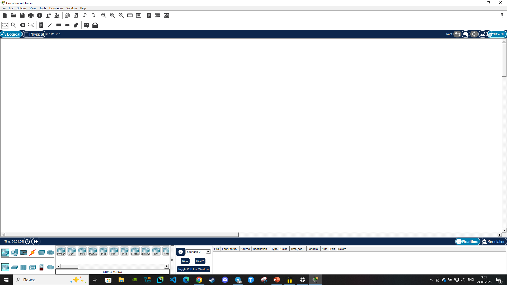

# Распределение IP адреса

* Вам потребуется скачать Cisco и прислать открытую работающую программу.

* Вам потребуется распределить 127.168 /24 IP адрес на подсети где 5 зданий с маршрутами и в каждом от 15 до 25 устройств.
* Найдите нужную длину для /* 20 подсетей и 10 узлов.

Так как количество зданий 5, нужно искать ближайшую степень числа 2 т. е. третью, поэтому к маске нужно добавить три бита - /27.
* Получившиеся подсети:
1. 192.168.0.0/27
2. 192.168.0.32/27
3. 192.168.0.64/27
4. 192.168.0.96/27
5. 192.168.0.128/27
