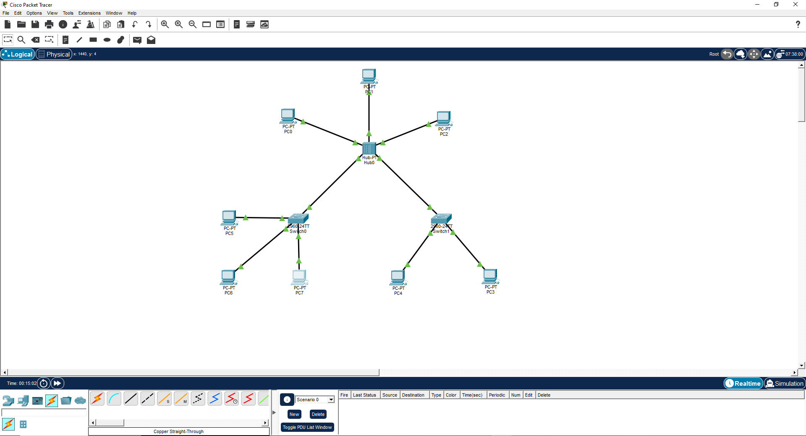
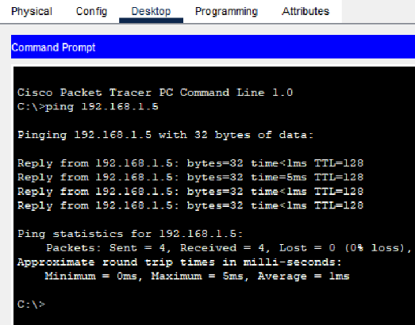
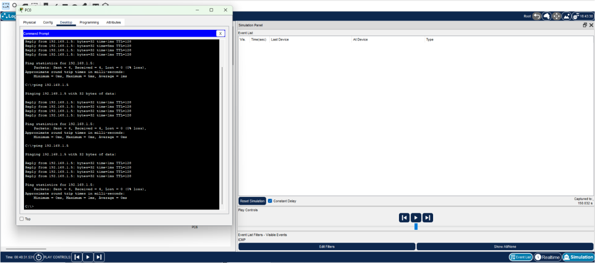

# Построение сетей в Cisco Packet Tracer

* Вам потребуется построить сеть в циско с 8 компьютерами, 2 комутаторами и 1 хабом.
Необходимо 3 фото на первом схема, на втором консольный ping, на третьем работа симулятора по отправки пинга.

